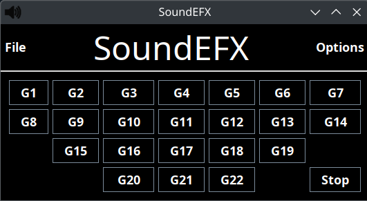

# SoundEFX

**SoundEFX** is a simple, lightweight application for managing and playing sound effects. Designed to work seamlessly with a standard keyboard or a Logitech G13 gamepad, this tool is ideal for users who need quick and efficient sound effect playback.



## Features

- Load and play sound effects with ease.
- Repeat mode functionality for looping sound effects.
- Keyboard and Logitech G13 integration for intuitive controls.

## Requirements

- **Java Runtime Environment (JRE)**: Version 2.0 of this app was reconfigured to support Java 21. It may work with older versions as far back as Java 6 as that was Java version the app was written for.

## Installation

1. **Download the Latest Release**:
   - Visit the [Releases](https://github.com/SEary342/SoundEFX/releases) page on GitHub and download the latest `.jar` file.

2. **Run the Application**:
   - Open a terminal or command prompt and navigate to the directory where the `.jar` file is saved.
   - Execute the following command:
     ```
     java -jar SoundEFX.jar
     ```

## Usage

1. Launch the application by running the `.jar` file.
2. Use your keyboard or Logitech G13 gamepad to control sound playback.
3. Select and load sound effects into the application.
4. Use the repeat mode for looping playback as needed.

## Building the Application

To build **SoundEFX** yourself:

1. Clone the repository:
   ```bash
   git clone https://github.com/SEary342/SoundEFX.git
   ```
2. Build the project using Gradle:
   ```bash
   ./gradlew build
   ```
3. The final executable JAR will be located in the `build/libs/` directory, named `SoundEFX.jar`.

## Customization

- Icon: You can change the application’s icon by replacing the spk.png file located in the src/resources/ folder.
- Dependencies: This application does not require non-standard library dependencies, so it is a stand-alone build.

## Contributing

Contributions are welcome! Feel free to submit issues or pull requests via the [GitHub repository](https://github.com/SEary342/SoundEFX).

## License

This project is licensed under the MIT License. See the [LICENSE](https://github.com/SEary342/SoundEFX/blob/main/LICENSE) file for details.
